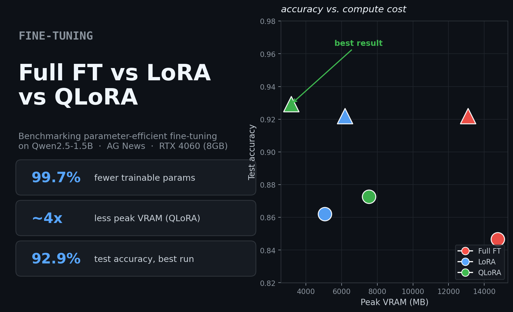
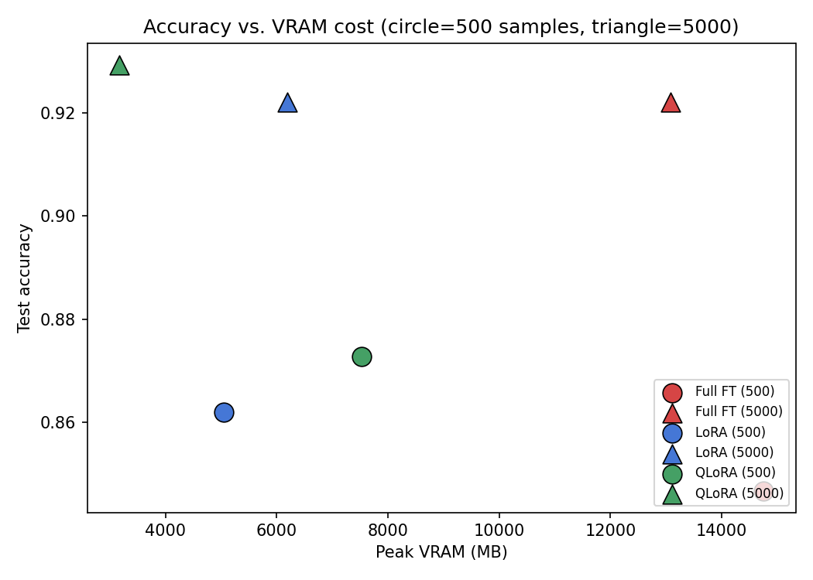
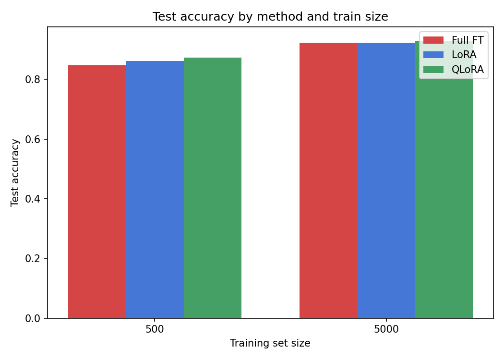
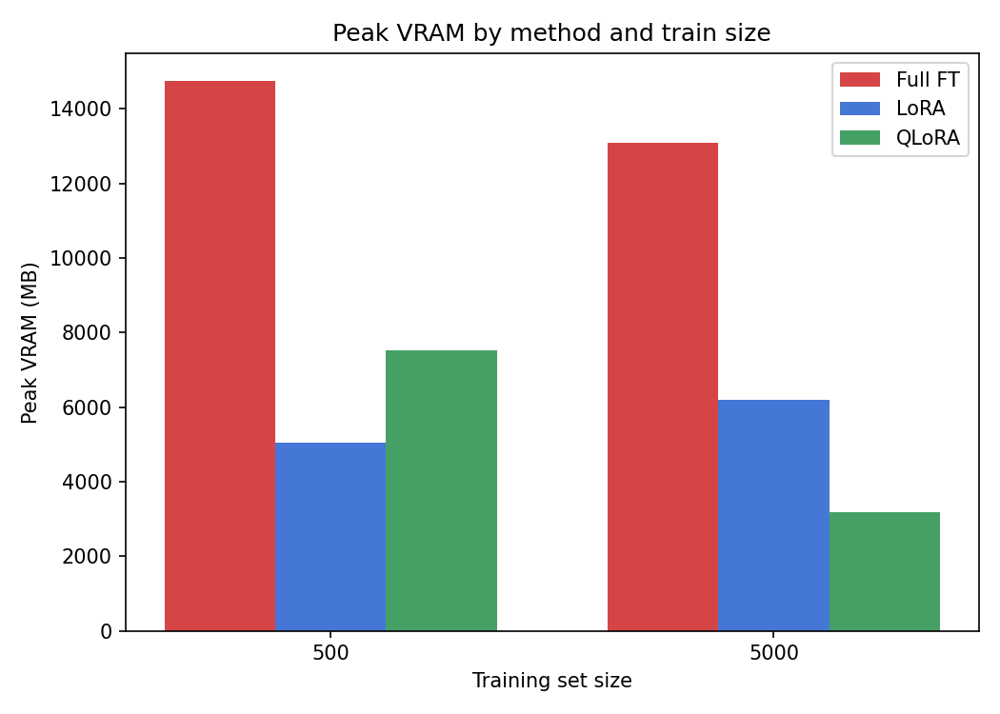
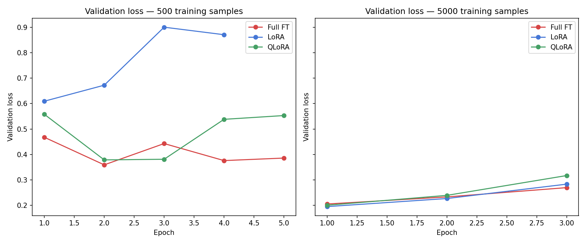

<p align="center">
  
</p>

# Full Fine-Tuning vs. LoRA vs. QLoRA — An Efficiency Benchmark

A from-scratch benchmark comparing three ways of adapting an LLM to a downstream task —
**full fine-tuning**, **LoRA**, and **QLoRA** — measuring the actual tradeoffs in VRAM,
training time, trainable parameters, and accuracy, on consumer hardware (a laptop RTX 4060,
8GB VRAM).

This isn't a "LoRA is always better" demo. Some of the more interesting results here are the
places where the numbers *didn't* behave the way the common wisdom predicts — see
[Anomalies & Honest Findings](#anomalies--honest-findings) below.

## TL;DR

| Method | Train size | Trainable params | Peak VRAM | Time | Test accuracy |
|---|---|---|---|---|---|
| Full FT | 500 | 1.54B (100%) | 14,748 MB | 1312.7s | 84.67% |
| Full FT | 5,000 | 1.54B (100%) | 13,080 MB | 4779.6s | 92.20% |
| LoRA | 500 | 4.36M (0.28%) | 5,050 MB | 265.0s | 86.20% |
| LoRA | 5,000 | 4.36M (0.28%) | 6,187 MB | 2462.8s | 92.20% |
| QLoRA | 500 | 4.36M (0.49%*) | 7,531 MB | 302.8s | 87.27% |
| **QLoRA** | **5,000** | **4.36M (0.49%*)** | **3,174 MB** | **1995.4s** | **92.93%** |

\* QLoRA's percentage isn't directly comparable to LoRA's — see the counting caveat below.

**Headline result:** QLoRA on 5,000 samples was the best run overall — highest accuracy,
*and* lowest VRAM of any 5,000-sample run — while training 99.7% fewer parameters than full
fine-tuning. Full fine-tuning never won outright on accuracy and was consistently the most
expensive method to run.

<p align="center">
  
</p>

## Why this project

Most public LoRA/QLoRA comparisons run on rented A100s and don't report what actually happens
when you're constrained to consumer hardware. This project deliberately works within an 8GB
laptop GPU's limits, and reports what broke, what needed workarounds, and what the real
numbers looked like — not just a clean success story.

## Setup

**Model:** [Qwen2.5-1.5B-Instruct](https://huggingface.co/Qwen/Qwen2.5-1.5B-Instruct)
**Dataset:** [AG News](https://huggingface.co/datasets/fancyzhx/ag_news) (4-class topic classification: World, Sports, Business, Sci/Tech)
**Task:** Sequence classification (`AutoModelForSequenceClassification`, randomly-initialized classification head)
**Hardware:** RTX 4060 laptop GPU (8GB VRAM)

Two training-set sizes were used to test how each method behaves in a low-data vs.
higher-data regime:
- **500 examples** (stratified, 4-class balanced)
- **5,000 examples** (stratified, 4-class balanced)

Both were evaluated on the same fixed, held-out **1,500-example test set**, sampled from
AG News's official test split and never touched during training or validation.

### Methods compared

| Method | What's frozen | What's trained |
|---|---|---|
| Full fine-tuning | Nothing | Every parameter (1.54B) |
| LoRA | Base model weights | Low-rank adapters on `q/k/v/o_proj` (r=16, α=32) + classification head |
| QLoRA | Base model weights (4-bit NF4 quantized) | Same LoRA adapters + classification head |

Learning rate was tuned per method (2e-5 for full-FT, 2e-4 for LoRA/QLoRA) — using the same
LR across methods would have been an *unfair* comparison, not a more rigorous one, since
LoRA's small adapter matrices need larger steps to learn effectively in the same number of
epochs.

## Installation

```bash
git clone <your-repo-url>
cd llm-finetuning-benchmark

conda create -n llm-bench python=3.10
conda activate llm-bench

pip install torch --index-url https://download.pytorch.org/whl/cu121
pip install -r requirements.txt
```

## Usage

```python
from src.train import run_experiment, run_all_experiments

# run one experiment
row = run_experiment(method="lora", train_size=500)

# run the full 6-experiment matrix
results = run_all_experiments()
```

Regenerate the charts from `results/results.csv`:
```bash
python -m src.visualize
```

Run the smoke test (fast, tiny-data sanity check that the pipeline works end to end):
```bash
python -m tests.test_pipeline
```

## Results

<p align="center">
  
  
</p>

- **Low-data regime (500 samples):** QLoRA > LoRA > Full FT on accuracy (87.27% > 86.20% >
  84.67%). Full fine-tuning overfits hardest with the least data — its training loss dropped
  to 0.009 while validation loss climbed back up after epoch 2, a textbook overfitting curve.
- **Higher-data regime (5,000 samples):** the accuracy gap narrows/reverses — QLoRA edges out
  both other methods (92.93% vs. 92.20% / 92.20%).
- **Efficiency:** LoRA/QLoRA train **99.7% fewer parameters** than full fine-tuning across the
  board. Full fine-tuning was the *only* method to exceed the physical 8GB VRAM limit
  (triggering Windows' driver-level system-memory fallback — see below); LoRA and QLoRA both
  stayed within budget on every run.

<p align="center">
  
</p>

The validation-loss curves above make the overfitting pattern visible directly: at 500
samples (left), every method's validation loss bottoms out early then rises; at 5,000 samples
(right), all three curves stay close together and rise only gently — far less overfitting
with more data.

## Anomalies & honest findings

These are the results that didn't come out clean, reported as-is rather than smoothed over —
this is where the actual engineering understanding shows up, not in the tidy numbers.

**1. Full fine-tuning silently exceeded physical VRAM.**
`torch.cuda.max_memory_allocated()` reported ~14.7GB peak usage for full fine-tuning on an
8GB card. This is real: recent NVIDIA Windows drivers transparently spill CUDA allocations
into system RAM instead of raising an out-of-memory error. This explains why full-FT runs
were disproportionately slow — system RAM is far slower than VRAM, and every access to the
spilled portion pays that cost. On a driver/OS without this fallback (or on Linux), the same
run would likely have failed outright with an OOM error.

**2. QLoRA used *more* VRAM than LoRA at 500 samples, but *less* at 5,000 samples.**
QLoRA-500 peaked at 7,531MB vs. LoRA-500's 5,050MB — the opposite of what QLoRA's 4-bit
quantization would predict. At 5,000 samples the relationship flipped as expected
(QLoRA: 3,174MB vs. LoRA: 6,187MB). The most likely explanation is that at this model scale
(1.5B params), the dequantization/quantization overhead in `bitsandbytes` can outweigh the
storage savings from 4-bit weights, combined with CUDA allocator fragmentation between runs.
QLoRA's memory advantage is generally more pronounced on much larger models (7B+), where base
weight storage dominates total memory — this result is a useful, concrete illustration of
that scaling caveat rather than a project bug.

**3. Trainable-parameter percentages aren't directly comparable between LoRA and QLoRA.**
Both methods train the identical LoRA adapter configuration (4,364,288 parameters), but
`total_params` differs — 1,548,084,736 for LoRA (bf16 base model) vs. 892,986,880 for QLoRA
(4-bit quantized base model) — because of how quantized weights are counted internally. The
*absolute* trainable count is the fair comparison; the *percentage* is not.

**4. Best validation checkpoint often wasn't the final epoch.**
With `load_best_model_at_end=False` (chosen to avoid multi-GB checkpoint saves — see below),
every run's test-set evaluation reflects the *final* epoch's weights, not necessarily the
best one seen during training. In several runs (e.g. full-FT-500), validation loss actually
bottomed out mid-training and rose afterward. This is noted rather than hidden — it's a
deliberate methodology tradeoff (disk space vs. optimal-checkpoint selection), not an
oversight.

**5. Disk space, not compute, was the first real bottleneck.**
Saving a full model checkpoint after every epoch (`save_strategy="epoch"`) consumed ~40GB for
a single 5-epoch run on a 1.5B model, and one save crashed mid-write from disk exhaustion.
All later runs switched to `save_strategy="no"` with `EarlyStoppingCallback` instead of
checkpoint-based best-model selection — a real constraint-driven design decision, not the
default choice.

## Project structure

```
llm-finetuning-benchmark/
├── src/
│   ├── utils.py         # generic helpers: sampling, tokenizing, VRAM/param tracking, metrics
│   ├── data.py           # AG News ETL: extract, stratified split, tokenize, disk-cache
│   ├── model.py           # model loading for full-FT / LoRA / QLoRA, dict-dispatched by method
│   ├── train.py            # generic experiment runner, config-driven per method/train size
│   └── visualize.py         # regenerates all charts from results.csv + epoch_log.csv
├── tests/
│   └── test_pipeline.py      # fast smoke test on a tiny sample, proves the pipeline runs end to end
├── notebooks/
│   └── exploration.ipynb      # the original exploratory notebook — kept to show the actual process
├── results/
│   ├── results.csv             # final metrics for all 6 experiments
│   ├── epoch_log.csv            # per-epoch train/val loss + accuracy for every run
│   └── charts/                   # generated PNGs
├── assets/
│   └── thumbnail.png
├── requirements.txt
└── README.md
```

## Limitations & future work

- Only one LoRA rank (r=16) was tested; a rank sweep (r=4/16/64) would show the
  capacity/efficiency tradeoff curve more completely.
- Only `q/k/v/o_proj` were targeted for LoRA; adding MLP layers (`gate/up/down_proj`) is a
  natural next comparison.
- Only two training-set sizes were tested; a wider sweep (e.g. 100 / 1k / 10k / 50k) would
  make the low-data-regime story more statistically convincing (each run here is a single
  seed, not averaged over multiple runs).
- All results come from a single run per configuration — training-run variance (especially
  at 500 samples) was not measured directly, though the overfitting/noise patterns observed
  are consistent with what's expected at this scale.

## Author

Muhammad Sami — BS Artificial Intelligence, GIKI
[GitHub](https://github.com/sleepy-kittens-404)